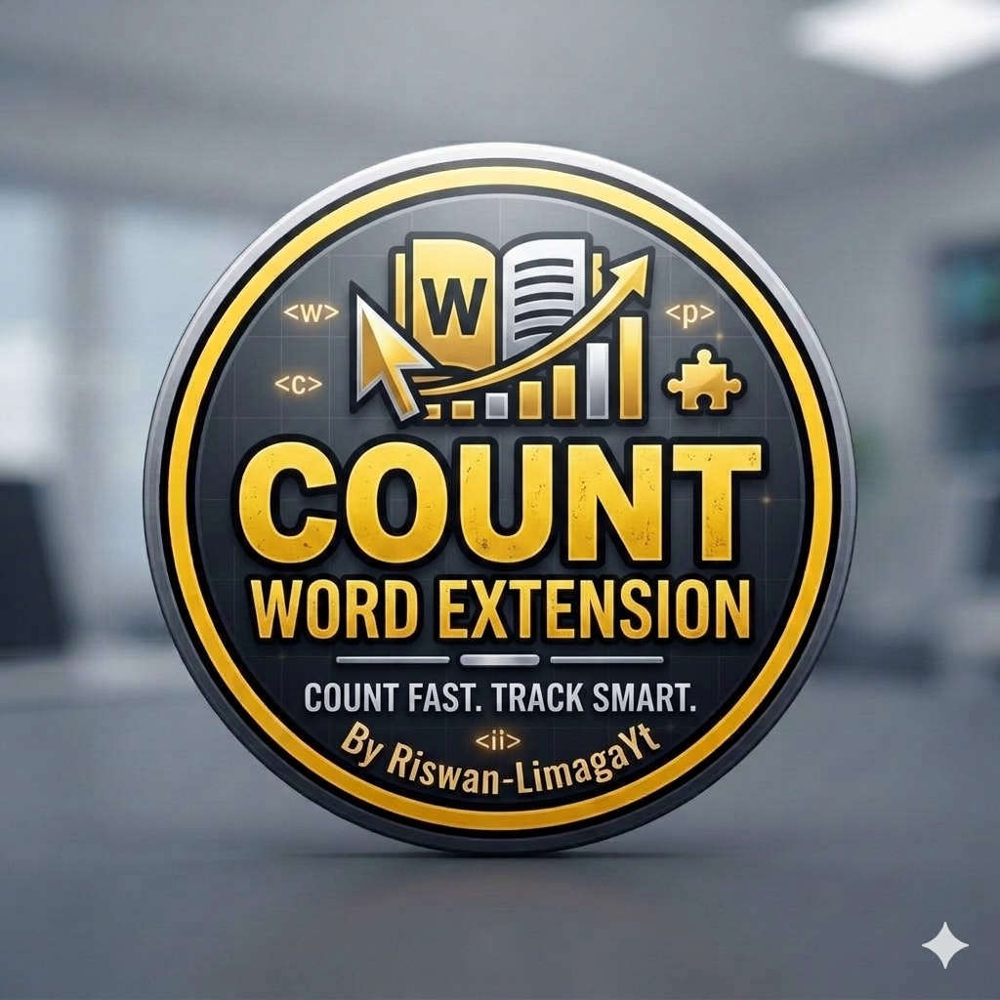

# 🔴 Quick Word & Character Counter ⚪
### *A Lightweight & Fast Text Stats Counter Extension*

<b>Created with passion by Riswan-LimagaYt</b>

---

## 📌 About The Project
**Quick Word & Character Counter** is a clean, easy-to-use browser extension built to analyze text on the fly. Whether you need to check character limits or estimate reading time, this tool does it instantly inside a sleek popup interface.

---

## ✨ Features
* 📊 **Live Word Counter**: Track your word count dynamically as you type.
* 🔤 **Character Count**: View accurate total character metrics.
* 📝 **Sentence Counter**: Break down text structure instantly.
* ⏱️ **Reading Time Estimator**: Quickly calculate how long text takes to read.

---

## 📥 Download & Install Instructions

1.1. **[Click Here to Download the ZIP File](https://github.com/LimagaOG/word_counter/raw/main/WordCounterRiswan.zip)**
2. Unzip or extract the downloaded `.zip` file into a folder on your computer.
3. Open your browser and go to `chrome://extensions/`.
4. Turn on **Developer mode** using the toggle switch in the top-right corner.
5. Click the **Load unpacked** button in the top-left corner.
6. Select your extracted extension folder.

🎉 **Done!** The extension icon will now appear in your browser toolbar, ready for use.

---

## 🔒 License & Copyright
Copyright (c) 2026 Riswan-LimagaYt. All rights reserved. Licensed under the MIT License.
